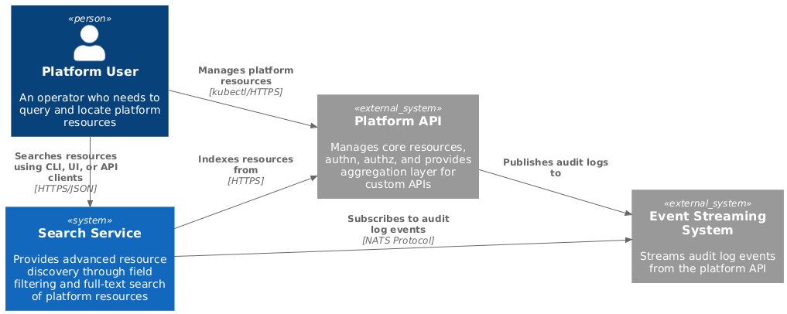

# Search

Search is a Kubernetes-native aggregated API server that provides advanced
resource discovery through field filtering and full-text search. It indexes
cluster resources in real-time via audit log events consumed from NATS
JetStream, with declarative indexing policies controlling what gets indexed
using CEL-based filtering. The service integrates natively with kubectl/RBAC and
targets Meilisearch as the search backend.

## Documentation

- [Architecture](./docs/architecture.md) — High-level design and component
  overview
- [Resource Indexer](./docs/components/resource-indexer.md) — Detailed design
  for the indexing component
