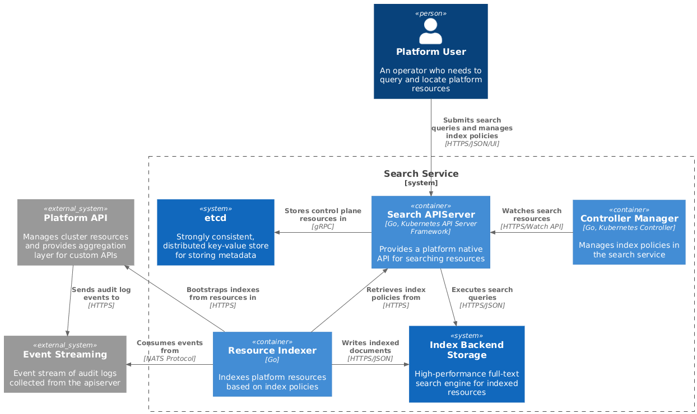

# Search Architecture

## Overview

The Search service is a Kubernetes-native API built on the [aggregated API
server framework][apiserver-aggregation] that provides advanced resource
discovery capabilities through field filtering and full-text search. It enables
platform users to efficiently query and locate resources across the cluster
using powerful indexing and real-time event processing.

## Architecture Diagram

> [!NOTE]
>
> Below is a [C4 container diagram][c4] of the service and it's dependencies.
> This is meant to model individual components in the system and their
> responsibilities. It does not aim to provide visibility into external system
> components that may be a dependency of this system.

  

[c4]: https://c4model.com

## Components

### Search API Server

**Purpose**: Expose search capabilities as native Kubernetes APIs

**Responsibilities**:
- Register custom API endpoints under `search.miloapis.com/v1alpha1`
- Handle authentication and authorization via Kubernetes RBAC
- Provide RESTful API for search queries
- Manage custom resource definitions for the search service

**Query Types**:
- **Field Filtering**: Exact match, prefix, range queries on structured fields
- **Full-Text Search**: Fuzzy matching, phrase queries, relevance scoring

### Resource Indexer

**Purpose**: Real-time indexing of platform resources from audit logs

**Responsibilities**:
- Subscribe to [NATS JetStream] audit log topic
- Filter events based on active index policies
- Evaluate [CEL expressions][CEL] for conditional indexing
- Extract and transform resource data for indexing
- Manage documents in index backend with proper error handling and retries
- Manage index lifecycle (creation, updates, deletion)
- Bootstrap indexes from existing state

See the [Resource Indexer Architecture](./components/resource-indexer.md) for
detailed design documentation.

### Controller Manager

**Purpose**: Manages and validates resources for the search service

**Responsibilities**:
- Validates and activates index policies

### Index Backend Storage

**Purpose**: High-performance full-text search and indexing

**Responsibilities**:
- Structured metadata (namespace, name, labels, annotations) filtering
- Full-text searchable content

> [!NOTE]
>
> We're targeting [Meilisearch] as our first integration backend for indexed
> storage.

[Meilisearch]: https://www.meilisearch.com
[apiserver-aggregation]:
    https://kubernetes.io/docs/concepts/extend-kubernetes/api-extension/apiserver-aggregation/
[NATS Jetstream]: https://nats.io
[CEL]: https://cel.dev

### etcd

**Purpose**: Distributed key-value store that provides reliable data storage
needs

**Responsibilities**:
- Store control plane resources for the Search API server (e.g. index policies)

[etcd]: https://etcd.io
