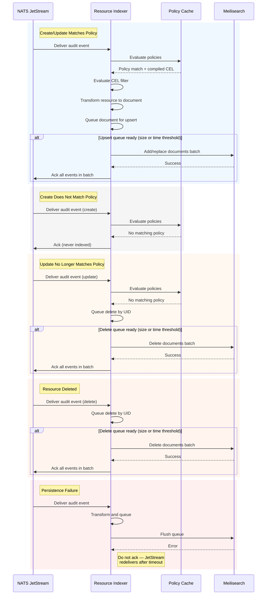
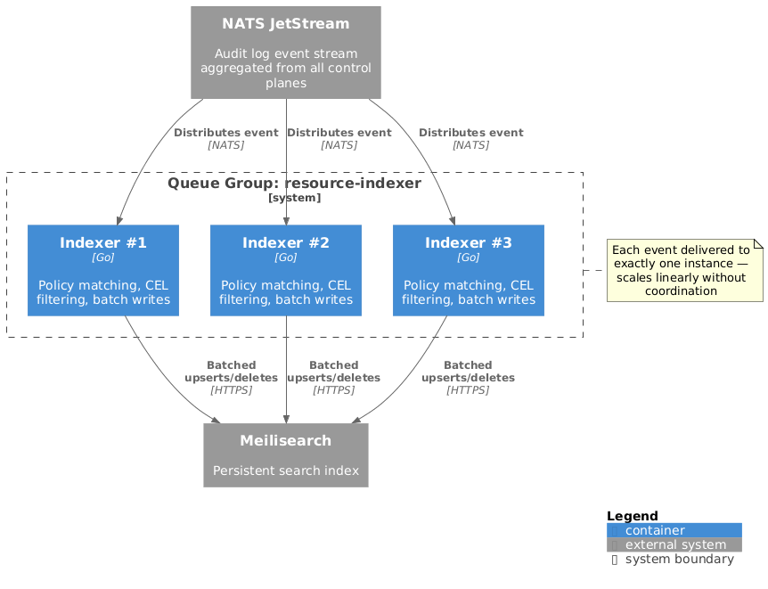

<!-- omit from toc -->
# Resource Indexer Architecture

- [Overview](#overview)
- [Design Goals](#design-goals)
- [Core Responsibilities](#core-responsibilities)
  - [Event Processing Flow](#event-processing-flow)
- [Event Consumption](#event-consumption)
  - [Horizontal Scaling](#horizontal-scaling)
  - [Kubernetes Configuration](#kubernetes-configuration)
- [Policy Management](#policy-management)
  - [CEL Compilation](#cel-compilation)
- [Document Lifecycle](#document-lifecycle)
  - [Transformation](#transformation)
- [Persistence and Acknowledgment](#persistence-and-acknowledgment)
  - [Batching](#batching)
  - [Duplicate Handling](#duplicate-handling)
- [Bootstrap Process](#bootstrap-process)
  - [Multi-Cluster Bootstrap](#multi-cluster-bootstrap)
- [Error Handling](#error-handling)
- [Integration Points](#integration-points)
- [Observability](#observability)
- [Future Considerations](#future-considerations)

## Overview

The Resource Indexer is a core component of the Search service responsible for
maintaining a searchable index of platform resources. It consumes audit log
events from NATS JetStream, applies policy-based filtering, and manages indexed
documents in the search backend.

## Design Goals

- **Real-time indexing**: Process resource changes within seconds of occurrence
- **Policy-driven**: Index only resources matching active index policy
  configurations
- **Reliable delivery**: Guarantee at-least-once processing of all events
- **Graceful recovery**: Resume processing from last known position after
  restarts
- **Horizontal scalability**: Scale throughput by adding instances without
  coordination

## Core Responsibilities

The Resource Indexer handles:

- Consuming audit log events from NATS JetStream
- Watching index policy resources and evaluating CEL filters
- Transforming Kubernetes resources into searchable documents
- Persisting documents to the index backend
- Acknowledging events only after successful persistence

### Event Processing Flow

The following diagram illustrates how the indexer processes events, including
policy matching, batching, and acknowledgment handling:

## Event Consumption

The indexer consumes audit log events from [NATS JetStream][jetstream] using
[durable consumers][durable-consumers]. JetStream provides:

- **Delivery guarantees**: At-least-once delivery with configurable ack timeouts
- **Position tracking**: Durable consumers track acknowledged messages; on
  restart, consumption resumes from the last acknowledged position
- **Backpressure**: Pull-based consumption allows the indexer to control its
  processing rate

[jetstream]: https://docs.nats.io/nats-concepts/jetstream
[durable-consumers]: https://docs.nats.io/nats-concepts/jetstream/consumers#durable-consumers

### Horizontal Scaling

The indexer uses JetStream [queue groups] for horizontal scaling. When multiple
instances join the same queue group, JetStream distributes messages across them
automatically — each message is delivered to exactly one instance.

  

This enables linear throughput scaling without coordination between instances.

[queue groups]: https://docs.nats.io/nats-concepts/core-nats/queue

### Kubernetes Configuration

In Kubernetes environments, JetStream resources (Streams, Consumers) can be
managed declaratively using [NACK] (NATS Controllers for Kubernetes). NACK
provides CRDs for defining [Streams] and [Consumers] as Kubernetes resources,
enabling GitOps workflows and consistent configuration across environments.

[NACK]: https://github.com/nats-io/nack
[Streams]: https://github.com/nats-io/nack/blob/main/docs/api.md#stream
[Consumers]: https://github.com/nats-io/nack/blob/main/docs/api.md#consumer

## Policy Management

Index policy resources define what to index. The indexer watches these resources
using a Kubernetes [informer], which provides:

- **List-watch semantics**: Initial list of all policies followed by a watch
  stream for changes
- **Local cache**: In-memory store for fast lookups during event processing
- **Automatic resync**: Periodic re-list to correct any drift

Each indexer instance maintains its own policy cache. Since events can be routed
to any instance (via queue groups), each instance caches all policies.
Index policy resources are typically small and few in number, so this
replication is acceptable.

### CEL Compilation

[CEL expressions][CEL] in policies must be compiled before evaluation. To avoid
recompilation on every event, compile expressions when policies are added or
updated and cache the compiled programs alongside the policy.

The indexer should wait for the informer cache to sync before processing events
to ensure all active policies are available for matching.

[informer]: https://pkg.go.dev/k8s.io/client-go/tools/cache#SharedInformer
[CEL]: https://cel.dev

## Document Lifecycle

The indexer manages documents in the search index based on audit events:

| Event Type | Policy Match | Action |
|------------|--------------|--------|
| Create | Yes | Upsert document |
| Create | No | Acknowledge only (never indexed) |
| Update | Yes | Upsert document |
| Update | No | Delete document (may have been indexed) |
| Delete | — | Delete document |

When a resource is updated and no longer matches any policy (e.g., labels
changed, CEL filter no longer passes), the indexer queues a delete. Since the
indexer doesn't track what was previously indexed, it always attempts deletion
for non-matching updates — Meilisearch treats deletes of non-existent documents
as no-ops.

### Transformation

When an event matches a policy, the indexer transforms the Kubernetes resource
into a searchable document:

- Extract fields specified in the index policy field mappings
- Normalize metadata (labels, annotations) into searchable formats
- Use the resource's UID as the document identifier

## Persistence and Acknowledgment

Documents are persisted to the index backend ([Meilisearch]). To guarantee
at-least-once delivery, events are only acknowledged after successful
persistence.

[Meilisearch]: https://www.meilisearch.com/docs

### Batching

For efficiency, batch multiple operations before persisting. The indexer
maintains separate queues for upserts and deletes since Meilisearch requires
separate API calls for each operation type. When either queue reaches its size
or time threshold:

1. Flush pending upserts via the [add documents][meilisearch-add-documents]
   endpoint
2. Flush pending deletes via the [delete documents][meilisearch-delete-documents]
   endpoint
3. On success, acknowledge all events whose operations were flushed
4. On failure, do not acknowledge — JetStream redelivers after ack timeout

Create events that don't match any policy can be acknowledged immediately since
the resource was never indexed. Update and delete events that don't match should
still queue a delete operation — the indexer cannot know whether the resource
was previously indexed, and Meilisearch delete operations are idempotent.

[meilisearch-add-documents]: https://www.meilisearch.com/docs/reference/api/documents#add-or-replace-documents
[meilisearch-delete-documents]: https://www.meilisearch.com/docs/reference/api/documents#delete-documents-by-batch

### Duplicate Handling

At-least-once delivery means duplicates are possible (e.g., after a failure
before acknowledgment). The index backend handles this via [document primary
keys][meilisearch-primary-key] — reindexing the same resource overwrites the
existing document.

[meilisearch-primary-key]: https://www.meilisearch.com/docs/learn/core_concepts/primary_key

## Bootstrap Process

On startup or when a new index policy is created, the indexer must populate the
index with existing resources. The platform spans multiple project control
planes, so bootstrap must list resources from each cluster.

### Multi-Cluster Bootstrap

The indexer uses the [multicluster-runtime] provider pattern to discover
project control planes. For each discovered cluster:

1. List resources matching the policy selector from that cluster's API
2. Transform and index each resource
3. Handle concurrent modifications during bootstrap gracefully

The provider handles dynamic cluster discovery — as clusters come online or go
offline, the indexer bootstraps or cleans up accordingly.

After bootstrap completes, real-time indexing continues via the JetStream event
stream, which already aggregates events from all control planes.

[multicluster-runtime]: https://github.com/kubernetes-sigs/multicluster-runtime

## Error Handling

- **Transient failures**: Retry with exponential backoff for network errors and
  temporary unavailability
- **Malformed events**: Log and skip events that cannot be parsed; acknowledge
  to prevent redelivery loops
- **Backend unavailability**: Buffer events in memory (bounded) while attempting
  reconnection; pause consumption if buffer fills
- **Policy evaluation errors**: Log and skip events with CEL evaluation
  failures; do not block processing of other events

## Integration Points

| System | Protocol | Purpose |
|--------|----------|---------|
| [NATS JetStream][jetstream] | NATS | Consume audit log events (aggregated from all clusters) |
| Search API Server | HTTPS | Watch index policy resources |
| Project Control Planes | HTTPS | Bootstrap existing resources |
| [Meilisearch] | HTTPS/JSON | Manage indexed documents |

## Observability

The indexer should expose metrics following the [RED method][red-method]:

- **Rate**: Events consumed per second, documents indexed per second
- **Errors**: Failed persistence operations, malformed events, policy evaluation
  errors
- **Duration**: Event processing latency, batch flush latency, end-to-end
  indexing lag

Specific metrics, instrumentation libraries, and observability tooling will be
defined during implementation.

[red-method]: https://www.weave.works/blog/the-red-method-key-metrics-for-microservices-architecture/

## Future Considerations

- **Control plane deletion**: When a project control plane is deleted, indexed
  resources from that cluster must be cleaned up. Ideally, the platform emits
  deletion events for all resources before the control plane is removed,
  allowing event-driven cleanup. If this isn't guaranteed, the indexer may need
  to track source cluster metadata and delete documents when a cluster is
  disengaged.
- **Dead letter handling**: Route persistently failing events to a dead letter
  queue for manual inspection
- **Multi-tenancy**: Support tenant-isolated indexes with policy-based routing
- **Policy-based sharding**: For very large deployments, assign subsets of
  policies to instances using consistent hashing
